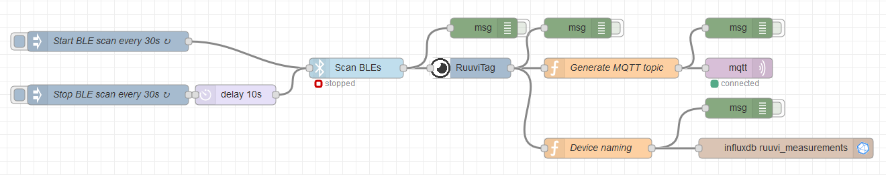

# Example Node

''' json
[{
		"id": "16282846.0cc62",
		"type": "inject",
		"z": "e53bb521.ce2ea8",
		"name": "Start BLE scan every 30s",
		"topic": "startBLEScan",
		"payload": "{ \"scan\": true }",
		"payloadType": "json",
		"repeat": "30",
		"crontab": "",
		"once": true,
		"onceDelay": "",
		"x": 190,
		"y": 160,
		"wires": [["38d7cf66.524e48"]]
	}, {
		"id": "38d7cf66.524e48",
		"type": "scan ble",
		"z": "e53bb521.ce2ea8",
		"uuids": "",
		"duplicates": false,
		"name": "",
		"x": 560,
		"y": 200,
		"wires": [["7d084d47.85e3dc", "fb80d469.26252"]]
	}, {
		"id": "7d084d47.85e3dc",
		"type": "ruuvitag",
		"z": "e53bb521.ce2ea8",
		"name": "",
		"x": 730,
		"y": 200,
		"wires": [["fb627207.a7988", "8810dc6c.92c4f8", "f1e7bb02.af96e8"]]
	}, {
		"id": "96f777cb.31bfa",
		"type": "inject",
		"z": "e53bb521.ce2ea8",
		"name": "Stop BLE scan every 30s",
		"topic": "stopBLEScan",
		"payload": "{ \"scan\": false }",
		"payloadType": "json",
		"repeat": "30",
		"crontab": "",
		"once": true,
		"onceDelay": "",
		"x": 190,
		"y": 240,
		"wires": [["3cc34fd0.91721"]]
	}, {
		"id": "76cb288f.9ab178",
		"type": "debug",
		"z": "e53bb521.ce2ea8",
		"name": "",
		"active": false,
		"console": "false",
		"complete": "true",
		"x": 1130,
		"y": 140,
		"wires": []
	}, {
		"id": "3cc34fd0.91721",
		"type": "delay",
		"z": "e53bb521.ce2ea8",
		"name": "",
		"pauseType": "delay",
		"timeout": "10",
		"timeoutUnits": "seconds",
		"rate": "1",
		"nbRateUnits": "1",
		"rateUnits": "second",
		"randomFirst": "1",
		"randomLast": "5",
		"randomUnits": "seconds",
		"drop": false,
		"x": 380,
		"y": 240,
		"wires": [["38d7cf66.524e48"]]
	}, {
		"id": "fb627207.a7988",
		"type": "function",
		"z": "e53bb521.ce2ea8",
		"name": "Generate MQTT topic",
		"func": "var device = null;\n       if (msg.peripheralUuid == \"f0977210bade\") {\n    device = \"wohnzimmer\";\n} else if (msg.peripheralUuid == \"eaa487776635\") { \n    device = \"bad\";\n} else if (msg.peripheralUuid == \"cb8cf2f41c53\") { \n    device = \"outdoor\";\n} else if (msg.peripheralUuid == \"dd4d8a54ba07\") { \n    device = \"dach\";\n} else if (msg.peripheralUuid == \"e6a2dfa0c9c8\") { \n    device = \"schlafzimmer\";\n} else if (msg.peripheralUuid == \"ffffffffffff\") {\n    device = \"bedroom3\";\n}\nmsg.topic = device + \"/measurements\";\nreturn msg;",
		"outputs": 1,
		"noerr": 0,
		"x": 940,
		"y": 200,
		"wires": [["d655414c.0a9828", "76cb288f.9ab178"]]
	}, {
		"id": "d655414c.0a9828",
		"type": "mqtt out",
		"z": "e53bb521.ce2ea8",
		"name": "",
		"topic": "",
		"qos": "",
		"retain": "",
		"broker": "6c05a863.74a028",
		"x": 1130,
		"y": 200,
		"wires": []
	}, {
		"id": "8927add7.e545d8",
		"type": "debug",
		"z": "e53bb521.ce2ea8",
		"name": "",
		"active": false,
		"tosidebar": true,
		"console": false,
		"tostatus": false,
		"complete": "true",
		"x": 1130,
		"y": 260,
		"wires": [],
		"inputLabels": ["Input"]
	}, {
		"id": "f1e7bb02.af96e8",
		"type": "function",
		"z": "e53bb521.ce2ea8",
		"name": "Device naming",
		"func": "var device = null;\nif (msg.peripheralUuid == \"f0977210bade\") {\n    device = \"Wohnzimmer\";\n} else if (msg.peripheralUuid == \"eaa487776635\") { \n    device = \"Bad\";\n} else if (msg.peripheralUuid == \"cb8cf2f41c53\") { \n    device = \"Outdoor\";\n} else if (msg.peripheralUuid == \"dd4d8a54ba07\") { \n    device = \"Dachzimmer\";\n} else if (msg.peripheralUuid == \"e6a2dfa0c9c8\") { \n    device = \"Schlafzimmer\";\n}\n\nvar newMsg = JSON.parse(msg.payload);\n\nvar formated = {\n    payload: [ newMsg, { tag: device, mac: msg.peripheralUuid} ]\n}\nreturn formated;",
		"outputs": 1,
		"noerr": 0,
		"x": 920,
		"y": 320,
		"wires": [["8927add7.e545d8", "5d13bcdc.f24574"]]
	}, {
		"id": "5d13bcdc.f24574",
		"type": "influxdb out",
		"z": "e53bb521.ce2ea8",
		"influxdb": "eb46006e.d8781",
		"name": "",
		"measurement": "ruuvi_measurements",
		"precision": "",
		"retentionPolicy": "",
		"x": 1200,
		"y": 320,
		"wires": []
	}, {
		"id": "8810dc6c.92c4f8",
		"type": "debug",
		"z": "e53bb521.ce2ea8",
		"name": "",
		"active": false,
		"tosidebar": true,
		"console": false,
		"tostatus": false,
		"complete": "true",
		"x": 890,
		"y": 140,
		"wires": []
	}, {
		"id": "fb80d469.26252",
		"type": "debug",
		"z": "e53bb521.ce2ea8",
		"name": "",
		"active": false,
		"tosidebar": true,
		"console": false,
		"tostatus": false,
		"complete": "true",
		"x": 750,
		"y": 140,
		"wires": []
	}, {
		"id": "6c05a863.74a028",
		"type": "mqtt-broker",
		"z": "",
		"broker": "localhost",
		"port": "1883",
		"clientid": "",
		"usetls": false,
		"compatmode": false,
		"keepalive": "60",
		"cleansession": true,
		"willTopic": "",
		"willQos": "0",
		"willPayload": "",
		"birthTopic": "",
		"birthQos": "0",
		"birthPayload": ""
	}, {
		"id": "eb46006e.d8781",
		"type": "influxdb",
		"z": "e53bb521.ce2ea8",
		"hostname": "localhost",
		"port": "8086",
		"protocol": "http",
		"database": "ruuvi",
		"name": "influxdb",
		"usetls": false,
		"tls": "e830c525.ef54b"
	}, {
		"id": "e830c525.ef54b",
		"type": "tls-config",
		"z": "",
		"name": "",
		"cert": "",
		"key": "",
		"ca": "",
		"certname": "",
		"keyname": "",
		"caname": "",
		"verifyservercert": true
	}
]
'''